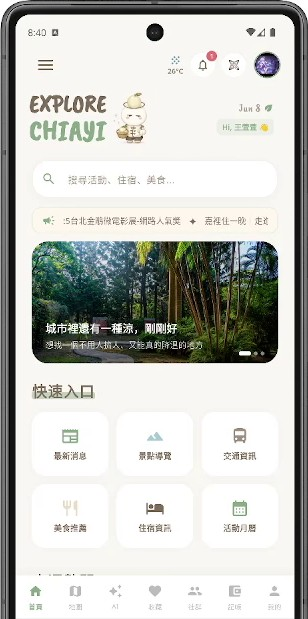
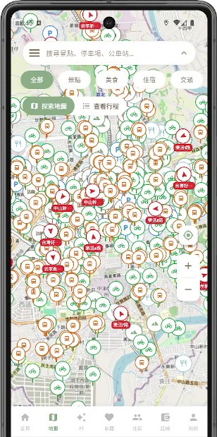
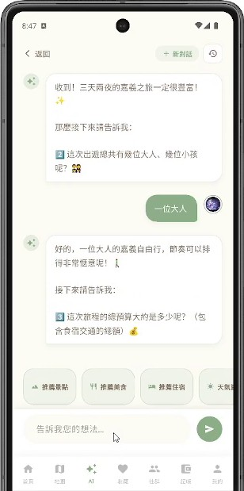
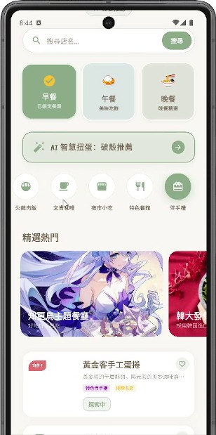
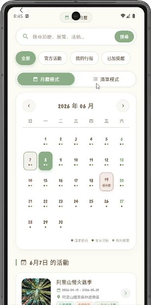
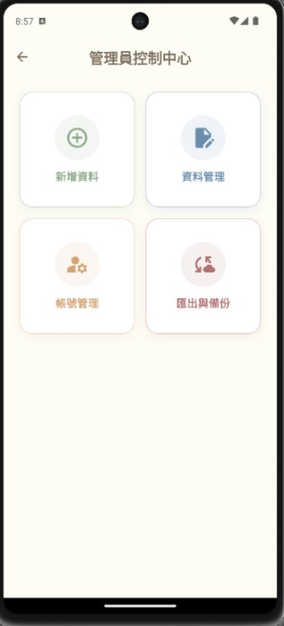
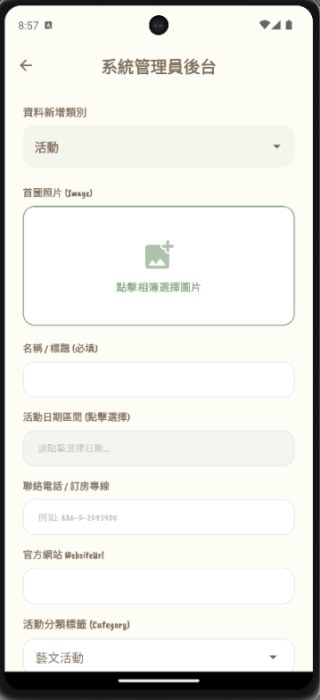
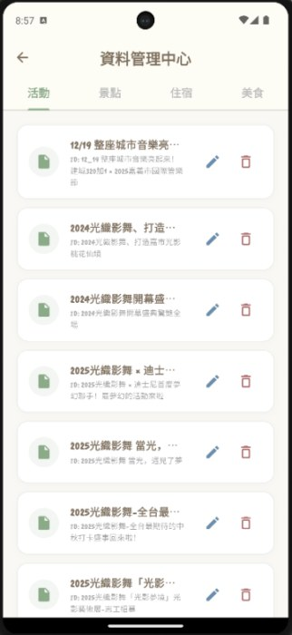
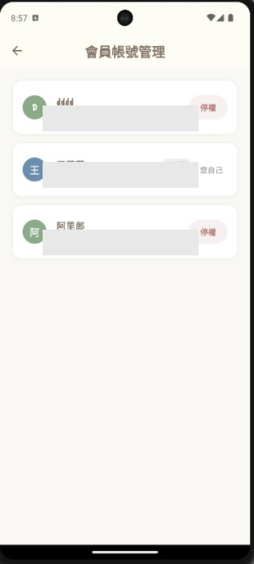
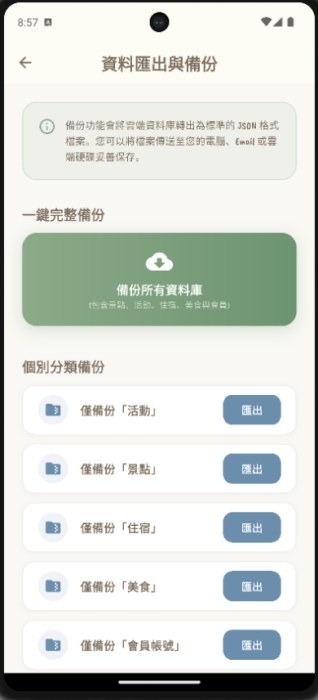

# Mobile App Final Project — ALIBUDA 探索嘉義

## Demo

▶️ **[點此播放完整 Demo 影片（11 分鐘）](demo.mp4)**

<p align="center">
  
  
  
  
</p>

## Introduction
ALIBUDA 是一款以 **Flutter** 開發、以嘉義在地觀光為主題的智慧旅遊 App，想讓自由行旅客從行前規劃、行中交通與記帳，到行後的社群分享，都能在同一個 App 裡完成。

針對自由行旅客的三個痛點設計了三個特色功能：
- **交通資訊太分散** → 四合一即時交通面板：台鐵誤點、市區公車動態、YouBike 2.0 車位、停車場剩餘車位
- **多人出遊分帳麻煩** → 多人共享記帳：Firebase Firestore 即時同步，旅程結束自動算出分帳建議
- **景點推薦太制式** → 集章打卡與 AI 扭蛋：靠近景點（GPS 距離判定）才能解鎖問答挑戰，答對得印章；AI 扭蛋依餐期、預算、類別隨機推薦在地美食

## Features
### 旅客端
- **帳號**: Email 註冊登入、Google / Facebook 登入，也可以訪客身分瀏覽
- **首頁**: GPS 即時天氣，下雨時提供 AI 雨天備案；「食、宿、景、曆、交、記」六大入口與活動輪播
- **景點 / 美食 / 住宿**: 關鍵字搜尋、分類篩選、詳情頁、導航與撥號、留言評論
- **活動月曆**: 嘉義官方活動與自己的行程，可切換月曆 / 清單檢視並加入提醒
- **交通資訊**: 台鐵班次與誤點、公車路線即時位置、YouBike 可借可還數量、停車場剩餘車位
- **地圖**: OSM 地圖標示景點、美食、住宿、公車站與 YouBike 站，並可檢視自己的行程路線
- **行程規劃**: 依 Day 分頁的行程時間軸，可新增站點、停留時間、交通方式與票價
- **AI 助理「阿布」**: Gemini 驅動，可一般對話問答，也能用對話方式產生客製化行程並存檔
- **收藏**: 收藏景點 / 美食 / 住宿 / 活動，勾選後一鍵交給 AI 排行程
- **社群分享牆**: 瀑布流貼文、分類篩選、按讚、留言、收藏、發布貼文
- **記帳**: 單人記帳與多人分帳，環形圖呈現支出比例，並自動產出分帳結算建議
- **個人頁**: 印章收集、解鎖嘉義夥伴角色、發布紀錄、編輯個人資料、系統設定

<p align="center">
  
</p>

### 管理者端
- 新增活動 / 景點 / 住宿 / 美食資料（圖片自動壓縮成 Base64 存入 Firestore）
- 分類檢視與刪除資料
- 會員管理，可停權違規帳號
- Firestore 資料一鍵備份匯出成 JSON

| 管理員控制中心 | 新增資料 | 資料管理中心 |
| :---: | :---: | :---: |
|  |  |  |

| 會員權限管理 | 資料匯出與備份 |
| :---: | :---: |
|  |  |

## Architecture
```
Flutter App (UI)
   │
   ├─ Service 層：Flutter Service + FastAPI Python Server (traffic_project/)
   │     └─ 定時向外部 API 取得資料、快取後提供給 App
   │
   ├─ 資料儲存：本地 SQLite + 雲端 Firebase (Auth / Firestore)
   │
   └─ 外部資料：TDX 台灣交通資訊、嘉義市政府停車場資訊、中央氣象署、
                OpenWeather、Gemini AI、OSM 地圖
```

### 交通資料後端 `traffic_project/`
- `scripts/`: Python 腳本定時向 TDX 取得火車、公車、YouBike 與停車場資料，整理成 JSON
    - 使用 OAuth2 client credentials 取得 TDX Access Token
    - 遇到 HTTP 429 時自動拉長請求間隔，並保留上一輪資料避免畫面出錯
    - 停車場同時整合 TDX 與嘉義市政府停車資訊網，每 60 秒更新
    - 天氣資料每 24 小時更新一次
- `server/`: FastAPI 伺服器，加上記憶體快取，減少手機直接呼叫外部 API 的次數

## Tech
- Flutter / Dart
- Firebase Authentication、Cloud Firestore、SQLite
- Google Gemini API（`google_generative_ai`）
- flutter_map（OpenStreetMap）、geolocator、fl_chart、table_calendar
- Python、FastAPI

## How to Run
所有 API 金鑰都已從程式碼移除並換成佔位字，執行前需要自行填入：

1. 複製 `.env.example` 為 `.env`，填入 `GEMINI_API_KEY`
2. 程式碼中的 `YOUR_GEMINI_API_KEY`（`ai_screen.dart`、`attractions_screen.dart`、`food_screen.dart`、`home_screen.dart`）與 `YOUR_OPENWEATHERMAP_API_KEY`（`weather_service.dart`）換成自己的金鑰
3. `traffic_project/` 中的 `YOUR_TDX_CLIENT_ID` / `YOUR_TDX_CLIENT_SECRET`（至 [TDX](https://tdx.transportdata.tw/) 申請）與 `YOUR_CWA_API_KEY`（至[中央氣象署開放資料平台](https://opendata.cwa.gov.tw/)申請）
4. 用 `flutterfire configure` 產生自己的 Firebase 設定（`lib/firebase_options.dart`、`android/app/google-services.json`）
5. 執行：
    ```bash
    flutter pub get
    ```
    ```bash
    flutter run
    ```
